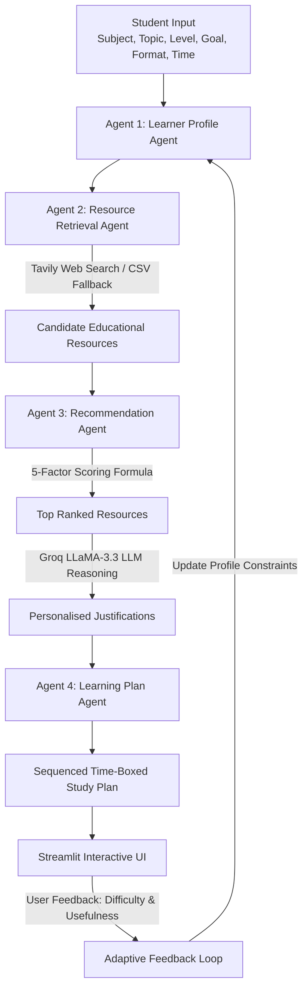

# 🎓 Personalised Learning Resource Recommendation Agent

A multi-agent AI system built with **Python**, **Streamlit**, **Tavily API**, and **Groq API** that generates personalized learning recommendations, scoring breakdowns, and time-bounded study plans tailored to an individual student's subject, topic, knowledge level, goal, format preferences, and study duration.

---

## 📌 Problem Statement

Students preparing for university exams, concept mastery, or competitive technical interviews often struggle with information overload. Generic search engines return overwhelming and unstructured links without considering:
1. The student's current proficiency level (Beginner vs Advanced).
2. The specific learning objective (Exam preparation vs Concept deep-dive vs Problem-solving practice).
3. Preferred media format (Video lectures, concise revision notes, practice question sets).
4. Realistic time constraints (e.g., a 2-hour study session).

**Solution:** This project implements an autonomous **4-Agent AI Workflow** that structures the learner's profile, retrieves tailored educational content via Tavily API search, scores and ranks resources using a transparent multi-criteria formula, generates AI reasoning via Groq LLM, and creates a time-boxed study schedule with active feedback adaptation.

---

## 🚀 Key Features

- **Agentic Multi-Stage Architecture:** 4 distinct, single-responsibility AI agents operating sequentially.
- **Dynamic Web & Offline Retrieval:** Live educational web search using Tavily API with intelligent offline fallback to a curated repository (`learning_resources.csv`).
- **Mathematical 5-Factor Scoring Engine:**
  - Topic Relevance: **35%**
  - Knowledge Level Match: **20%**
  - Learning Goal Match: **20%**
  - Format Preference: **15%**
  - Time Budget Compatibility: **10%**
- **AI-Powered Explanations:** Real-time Groq LLM (LLaMA-3.3-70B) reasoning explaining why each resource was selected.
- **Time-Bounded Study Schedule:** Generates a realistic, pedagogical timeline (Foundation $\rightarrow$ Theory $\rightarrow$ Practice $\rightarrow$ Review) guaranteed not to exceed available study hours.
- **Closed-Loop Feedback System:** Dynamically re-calibrates difficulty levels ("Too Easy" / "Too Difficult") and penalizes unhelpful resources upon user feedback.
- **Modern Streamlit Interface:** Card-based UI, badge pills, direct link buttons, scoring breakdown expanders, and 1-click college demonstration loader.

---

## 🏗️ System Architecture & Workflow



---

## 🤖 The Four Agents Explained

| Agent | Module | Responsibility |
|---|---|---|
| **1. Learner Profile Agent** | [`agents/learner_profile.py`](file:///agents/learner_profile.py) | Ingests user requirements, converts durations to minutes, and generates targeted search query representations. |
| **2. Resource Retrieval Agent** | [`agents/resource_retrieval.py`](file:///agents/resource_retrieval.py) | Uses Tavily API to find live educational resources (YouTube, GFG, Sanfoundry, etc.) with safe local fallback. |
| **3. Recommendation Agent** | [`agents/recommendation.py`](file:///agents/recommendation.py) | Evaluates candidates using the 5-factor mathematical scoring engine and generates Groq LLM explanations. |
| **4. Learning Plan Agent** | [`agents/learning_plan.py`](file:///agents/learning_plan.py) | Sequences resources into a logical study timeline fitting strictly within the student's available time. |

---

## 📐 Transparent Scoring Formula

For each candidate resource $R$, the composite match score $S(R) \in [0, 100]$ is computed as:

$$S(R) = \left( 0.35 \times T + 0.20 \times L + 0.20 \times G + 0.15 \times F + 0.10 \times C \right) \times 100 - P_{\text{feedback}}$$

Where:
- $T \in [0, 1]$: **Topic Relevance Score** (Exact substring match and keyword overlap ratio).
- $L \in [0, 1]$: **Level Match Score** (Distance between resource level and student's target level).
- $G \in [0, 1]$: **Goal Match Score** (Exam revision vs Conceptual clarity vs Practical exercises).
- $F \in [0, 1]$: **Format Match Score** (Video, Notes, Articles, Practice alignment).
- $C \in [0, 1]$: **Time Compatibility** (Checks whether resource duration fits cleanly in session budget).
- $P_{\text{feedback}}$: **Negative Penalty** applied if the student previously marked the resource as "Not Useful".

---

## 📁 Project Structure

```text
personalized-learning-agent/
│
├── app.py                      # Streamlit interactive UI application
├── agents/
│   ├── learner_profile.py      # Agent 1: Profile synthesis & query formulation
│   ├── resource_retrieval.py   # Agent 2: Tavily search & CSV fallback retrieval
│   ├── recommendation.py       # Agent 3: Scoring engine & Groq reasoning
│   └── learning_plan.py        # Agent 4: Time-capped sequential study schedule
├── utils/
│   ├── api_client.py           # Safe API clients for Tavily and Groq
│   └── scoring.py              # 5-factor mathematical scoring formulation
├── data/
│   └── learning_resources.csv  # Curated fallback dataset (CN, OS, DBMS, DSA)
├── tests/
│   └── test_agents.py          # Unit & integration test suite (unittest / pytest)
├── .env.example                # API key template
├── .gitignore                  # Security exclusions
├── requirements.txt            # Python dependencies
└── README.md                   # Complete documentation
```

---

## ⚙️ Setup and Execution

### 1. Prerequisites
- Python 3.9+ (Python 3.10, 3.11, 3.12, 3.14 tested)

### 2. Installation

Clone repository or navigate to the project directory:
```bash
cd Flexi_CA3
```

Install dependencies:
```bash
pip install -r requirements.txt
```

### 3. API Keys Configuration (Optional)
Copy `.env.example` to `.env`:
```bash
cp .env.example .env
```
Add your API keys inside `.env` or input them directly via the Streamlit web sidebar:
```env
TAVILY_API_KEY=tvly-your_tavily_key_here
GROQ_API_KEY=gsk_your_groq_key_here
```
> **Note:** If API keys are omitted, the application runs in **Intelligent Offline Mode** with curated datasets and algorithmic reasoning.

### 4. Run the Web Application
```bash
streamlit run app.py
```
Open your browser at `http://localhost:8501`.

---

## 🧪 Running Automated Tests

Run the test suite to verify scoring differentiation, feedback loops, time budgeting, and fallbacks:
```bash
python -m unittest discover -s tests -v
```

### Test Coverage Summary
- `test_learner_profile_creation`: Validates profile normalization and search query generation.
- `test_scoring_different_levels`: Verifies Beginner vs Advanced resource rank differentiation.
- `test_scoring_different_goals`: Verifies Exam vs Practice vs Concept scoring alignment.
- `test_scoring_different_formats`: Verifies format weighting boosts.
- `test_learning_plan_time_constraint`: Verifies study plan duration $\le$ available time budget.
- `test_feedback_adaptation`: Tests dynamic level shifting and unhelpful resource penalization.
- `test_retrieval_offline_fallback`: Verifies 100% offline retrieval reliability.

---

## 🎯 Viva Demonstration Scenario

Click the **"🚀 Load College Demo Scenario"** button in the sidebar:
- **Subject:** Computer Networks
- **Topic:** IPv4 and Subnetting
- **Level:** Beginner
- **Goal:** Exam Preparation
- **Preferred Formats:** Video + Notes
- **Available Time:** 2.0 Hours (120 Mins)

### Expected Output:
1. **Profile:** Beginner target level, 120-minute budget, exam-focused query tokens.
2. **Top Recommendations:** High scores for *Subnetting Cheat Sheet & Notes* and *IPv4 & Subnetting Explained for Beginners*.
3. **Groq Reasoning:** Explains why each resource fits beginner exam prep within 2 hours.
4. **Study Plan:** Step-by-step 4-phase schedule summing to exactly 120 minutes.
5. **Feedback Loop:** Selecting "Too Difficult" shifts the target level downwards; marking "Not Useful" downranks the item immediately.

---

## 💡 Viva Questions & Quick Answers

**Q1: What makes this an "Agentic" AI system instead of a simple script?**
> *Answer:* The system decomposes the problem into 4 autonomous, specialized agents (Profile, Retrieval, Recommendation, Plan) with distinct responsibilities, structured message passing, multi-criteria reasoning, and a closed-loop feedback mechanism that adapts future behavior based on user input.

**Q2: Why use both Tavily and Groq?**
> *Answer:* Tavily is an agentic search engine tailored for high-signal web retrieval. Groq provides ultra-fast inference on state-of-the-art open models (LLaMA-3.3-70B) for instant, personalized pedagogical reasoning without latency.

**Q3: How does the system handle API rate limits or network failures?**
> *Answer:* Through graceful degradation: if Tavily is unavailable, Agent 2 falls back to `learning_resources.csv`; if Groq is unavailable, Agent 3 uses a deterministic rule-based reasoning engine.

---

## 🔮 Limitations & Future Scope

- **Limitations:** Currently supports single-session study plans without long-term multi-week spaced repetition tracking.
- **Future Scope:**
  - Automated PDF/Syllabus upload for direct exam curriculum extraction.
  - Multi-session calendar scheduling (e.g., syncing study plan to Google Calendar).
  - Integration of interactive quiz generation based on the recommended notes.
